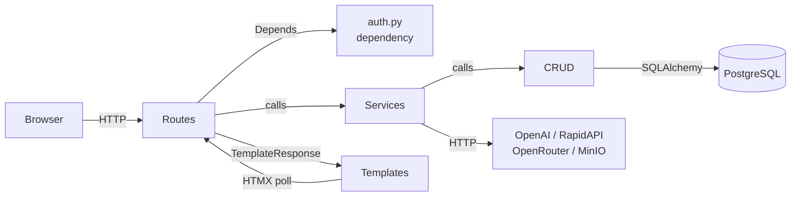
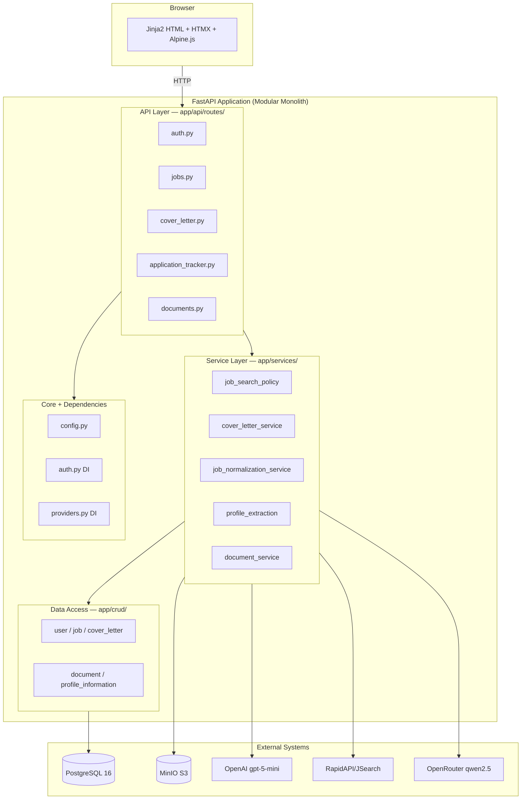

# 02 — Project Architecture

> **Related documents:** [01-executive-summary.md](01-executive-summary.md) | [04-project-structure.md](04-project-structure.md) | [assets/architecture-diagram.md](assets/architecture-diagram.md) | [assets/component-diagram.md](assets/component-diagram.md) | [assets/data-flow-diagram.md](assets/data-flow-diagram.md)

---

## Overall Architecture Style

AI Job Copilot is a **Modular Monolith** with a **Client–Server** request pattern.

All application code runs in a single Python process (FastAPI/Uvicorn). There are no microservices, no message queues, and no separate frontend build. The "modularity" comes from rigidly separated layers within the monolith, not from service boundaries.

**Why modular monolith?**
- Appropriate for a university/prototype-scale project with a single developer
- Eliminates distributed-system complexity (network partitions, serialisation overhead, deployment coordination)
- FastAPI's dependency injection system provides clean module boundaries without requiring inter-process communication

---

## Architectural Layers

| Layer | Location | Responsibility |
|---|---|---|
| **Presentation** | `templates/` | Jinja2 HTML rendered server-side; HTMX + Alpine.js for in-page interactivity |
| **API / Route** | `app/api/routes/` | Receive HTTP requests, validate forms, call services, render templates or redirect |
| **Service** | `app/services/` | Business logic, LLM orchestration, external API calls, transaction ownership |
| **Data Access (CRUD)** | `app/crud/` | Thin read/write functions; all assume a SQLAlchemy session is passed in; never commit |
| **Domain Models** | `app/models/` | SQLAlchemy ORM table definitions |
| **Schemas** | `app/schemas/` | Pydantic models for form validation and LLM output parsing |
| **Core** | `app/core/` | Configuration (`Settings`), enums, password hashing |
| **Dependencies** | `app/dependencies/` | FastAPI DI: auth guard, provider factory, template context builders |

---

## Responsibilities of Each Layer

### Presentation Layer (`templates/`)
- 33 Jinja2 templates; all extend `base.html`
- German UI strings hardcoded in templates (no i18n file)
- HTMX attributes (`hx-get`, `hx-post`, `hx-swap`) drive server-side fragment updates
- Alpine.js (`x-data`, `@click`) manages lightweight toggle state (menu open, collapsible sections)
- Inline JavaScript (no `.js` files) handles complex interactions: cover letter editor content sync, unsaved-changes guards, PDF export

### API / Route Layer (`app/api/routes/`)
- 11 router modules registered in `app/main.py`
- Routes are deliberately **thin**: they validate input, call one service, and return a response
- All responses are HTML (Jinja2 render or redirect); no JSON API endpoints for the main UI
- Auth guard injected via `Depends(get_current_user)` on every protected route

### Service Layer (`app/services/`)
- 19 modules — the bulk of the application logic lives here
- **Transaction boundary**: services call `db.commit()` and `db.rollback()`; CRUD modules do not
- External calls (OpenAI, RapidAPI, MinIO) happen exclusively in services
- Long-running work is enqueued as FastAPI `BackgroundTasks` and status is polled by the browser

### Data Access Layer (`app/crud/`)
- 13 modules, one per domain entity
- Functions accept a `db: Session` parameter and perform a single, focused DB operation
- No business logic; no transactions; no LLM calls

### Domain Models (`app/models/`)
- SQLAlchemy 2.0 declarative-style ORM classes
- JSONB columns used for structured data that changes shape over time (cover letter `content`, `layout_settings`, job normalization `normalized_data`)
- Array columns (PostgreSQL-native) for multi-value filters (`employment_types`, `experience_levels`)

---

## Component Interactions



*(Full diagram: [assets/component-diagram.md](assets/component-diagram.md))*

---

## Data Flow Through the System

1. **Browser** sends an HTTP POST/GET (form submission or HTMX fragment request)
2. **FastAPI middleware** validates the session cookie via `SessionMiddleware` (Starlette)
3. **Auth dependency** (`get_current_user`) verifies session timestamps, fetches the user from DB
4. **Route handler** receives the validated request + authenticated user
5. **Service** is called with domain inputs; it may call external APIs and/or background tasks
6. **CRUD** is called by the service to read/write data; the service commits the transaction
7. **Template** is rendered with context data and returned to the browser as a complete HTML page (or fragment for HTMX swaps)

---

## Request Lifecycle Example: Job Search

| Step | Code Location | Action |
|---|---|---|
| 1 | `browser` | User clicks "Suchen" → POST /jobs/search/{profile_id} |
| 2 | `app/main.py` | SessionMiddleware validates cookie |
| 3 | `app/dependencies/auth.py` | `get_current_user()` validates session timestamps, returns User |
| 4 | `app/api/routes/jobs.py` | Route calls `job_search_policy.decide_primary_search()` |
| 5 | `app/services/job_search_policy.py` | Checks daily limit, existing run; returns decision enum |
| 6 | `app/dependencies/providers.py` | Injects `LiveJobSearchProvider` or `FixtureJobSearchProvider` |
| 7 | `app/services/live_job_search_provider.py` | HTTP GET to RapidAPI; returns `JobSearchResult` |
| 8 | `app/services/job_search_response_mapper.py` | Maps API JSON → ORM Job objects |
| 9 | `app/services/job_search_persistence.py` | INSERT/upsert jobs, search_run, search_run_jobs; commits |
| 10 | `app/api/routes/jobs.py` | `TemplateResponse("job_results.html", context)` |
| 11 | `browser` | Receives full HTML page with job cards |

---

## Architecture Diagram



*(Full diagram with labels: [assets/architecture-diagram.md](assets/architecture-diagram.md))*

---

## Provider Strategy Sub-Pattern

The job search provider is selected at startup via the `JOB_SEARCH_PROVIDER` environment variable:

```
JOB_SEARCH_PROVIDER=fixture  → FixtureJobSearchProvider (hardcoded mock data)
JOB_SEARCH_PROVIDER=live     → LiveJobSearchProvider (RapidAPI/JSearch HTTP calls)
```

Both providers implement the `JobSearchProvider` protocol defined in `app/services/job_search_provider.py`. The route never knows which one it received — this is pure dependency injection via `app/dependencies/providers.py`.

This pattern enables development and testing without consuming API credits or hitting rate limits.

---

## Background Task Architecture

FastAPI's built-in `BackgroundTasks` is used for operations that would otherwise block the HTTP response:

| Operation | File | Duration |
|---|---|---|
| Cover letter generation | `app/services/cover_letter_service.py` | 5–30 seconds (3–5 LLM calls) |
| CV text extraction | `app/services/document_service.py` | 2–10 seconds (PDF parse + 2 LLM calls) |
| Job normalization | `app/services/job_normalization_task.py` | 3–10 seconds (1 LLM call) |

The browser polls a status endpoint every 2 seconds via HTMX partial updates until the task completes, then redirects to the result page.

**Limitation:** There is no persistent task queue (no Celery, no Redis). If the server restarts while a task is running, the cover letter record is left in `PENDING` state and must be manually reset or regenerated. This is an accepted trade-off for a prototype.
