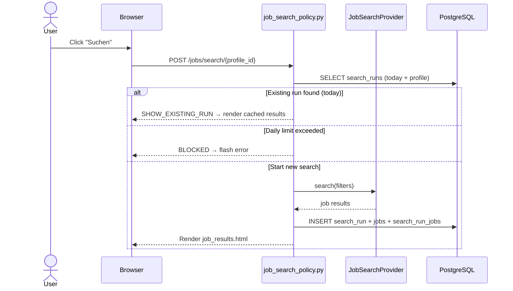
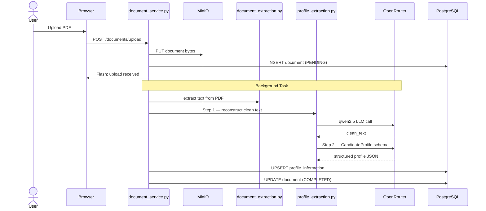
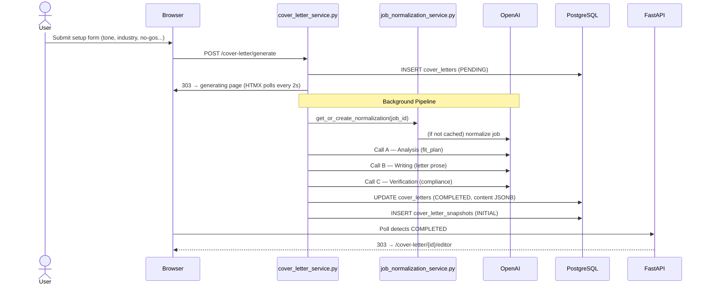

# 06 — User Flows

> **Related documents:** [05-features.md](05-features.md) | [07-api-analysis.md](07-api-analysis.md) | [assets/sequence-diagrams.md](assets/sequence-diagrams.md)

All sequence diagrams in full are available in [assets/sequence-diagrams.md](assets/sequence-diagrams.md).

---

## Flow 1: User Registration

**User Goal:** Create an account to use the platform.

**Trigger:** User navigates to `/auth` or is redirected from a protected page.

| Step | Frontend Action | Backend Action | DB Action | AI Action |
|---|---|---|---|---|
| 1 | Visit `/auth` | Render `auth.html` | — | — |
| 2 | Fill registration form | Receive `POST /auth/register` | — | — |
| 3 | — | `auth_service.register_user_account()` | SELECT to check email uniqueness | — |
| 4 | — | `bcrypt.hash(password)` | INSERT users | — |
| 5 | — | Set session: `user_id`, `created_at`, `last_seen` | — | — |
| 6 | Redirected to Dashboard | 303 → `/dashboard` | — | — |

**Final Result:** User is authenticated and lands on the dashboard.

---

## Flow 2: Login

**User Goal:** Authenticate with existing credentials.

**Trigger:** User submits login form on `/auth`.

| Step | Frontend | Backend | DB | AI |
|---|---|---|---|---|
| 1 | Submit email + password | `POST /auth/login` | — | — |
| 2 | — | Fetch user by email | SELECT users WHERE email=? | — |
| 3 | — | `bcrypt.verify(password, hash)` | — | — |
| 4 | — | Set session cookie | — | — |
| 5 | 303 → `/dashboard` | — | — | — |

**Error path:** Wrong password → flash error "Ungültige Anmeldedaten", stay on `/auth`.

---

## Flow 3: Job Search

**User Goal:** Find relevant job postings using a saved search profile.

**Trigger:** User selects a profile and clicks "Suchen" on `/jobs`.

**Final Result:** User sees a paginated list of job cards for the current day's search.

---

## Flow 4: Save a Job to Tracker

**User Goal:** Mark a job as "saved" to begin tracking the application.

**Trigger:** User clicks "Merken" (save) on a job card in search results.

| Step | Frontend | Backend | DB | AI |
|---|---|---|---|---|
| 1 | Click "Merken" | `POST /tracker/{job_id}/status` (status=SAVED) | — | — |
| 2 | — | `application_tracker_service.update_status()` | UPSERT application_tracker_entries | — |
| 3 | Flash success message | 303 redirect back | — | — |

---

## Flow 5: Job Normalization (Background)

**User Goal:** Understand a job description in structured form (trigger for cover letter).

**Trigger:** Clicking "Analysieren" on a job card, or automatically during cover letter generation.

| Step | Frontend | Backend | DB | AI |
|---|---|---|---|---|
| 1 | Click "Analysieren" | `POST /jobs/{job_id}/normalize` | — | — |
| 2 | HTMX shows spinner (polls every 2s) | Enqueue `BackgroundTask` | UPDATE processing_status=PENDING | — |
| 3 | — | `job_normalization_task.run()` | SELECT job (raw text) | OpenAI Responses API: raw text → JobNormalizationSchema |
| 4 | — | — | INSERT job_normalizations; append evals/job_normalizations.jsonl | — |
| 5 | HTMX swap: spinner → results | Poll returns status=COMPLETED | — | — |

**Final Result:** Structured job data visible on the job card (requirements, keywords, industry, hierarchy).

---

## Flow 6: CV Upload & Profile Extraction

**User Goal:** Upload CV so the platform can pre-populate cover letters.

**Trigger:** User navigates to `/documents` and selects a PDF file to upload.

**Final Result:** User's profile is populated; cover letter generation can now use real candidate data.

---

## Flow 7: Cover Letter Generation

**User Goal:** Generate a personalised, professional cover letter for a specific job.

**Trigger:** User navigates to cover letter setup page and submits the configuration form.

**Final Result:** User lands in the editor with a generated, validated cover letter ready to review.

---

## Flow 8: Cover Letter Editing & Export

**User Goal:** Review, edit, and download the generated cover letter as a PDF.

**Trigger:** User arrives at the editor after generation, or re-opens a saved cover letter.

| Step | Frontend | Backend | DB | AI |
|---|---|---|---|---|
| 1 | Editor loads with generated content | `GET /cover-letter/{id}/editor` | SELECT cover_letter + profile | — |
| 2 | User switches template (classic→modern) | HTMX GET preview with new template | Re-renders preview fragment | — |
| 3 | User edits text in contentEditable fields | `_syncHiddenInputs()` runs | — | — |
| 4 | User clicks "Speichern" | `POST /cover-letter/{id}/content-save` | INSERT cover_letter_snapshots (USER_REVISION); UPDATE content | — |
| 5 | User clicks "PDF exportieren" | JS flushes content, generates presigned URL or iframe | SELECT cover_letter | WeasyPrint renders PDF |
| 6 | PDF downloaded | Browser receives PDF blob | — | — |

**Navigation Guard:** If user tries to leave with unsaved changes, a modal dialog appears with 4 options: Cancel / Discard / Save Draft / Save Document.

---

## Flow 9: Application Status Update

**User Goal:** Move an application to the next stage (e.g., after an interview).

**Trigger:** User clicks a status button in the tracker.

| Step | Frontend | Backend | DB |
|---|---|---|---|
| 1 | Click status button (e.g., "Vorstellungsgespräch") | `POST /tracker/{job_id}/status` | — |
| 2 | — | `application_tracker_service.update_status()` | UPDATE application_tracker_entries (status, interview_at) |
| 3 | Flash success | 303 redirect | — |

**Final Result:** Tracker entry updated; date of status change recorded.

---

## Flow 10: Session Expiry

**User Goal:** (Involuntary) Session expires while working.

**Trigger:** 30 minutes of inactivity OR 8 hours since login.

| Step | What Happens |
|---|---|
| 1 | User makes any authenticated request |
| 2 | `get_current_user()` checks `now - last_seen > 1800s` (idle) OR `now - created_at > 28800s` (absolute) |
| 3 | Session is cleared; `AuthenticationRequiredError(SESSION_EXPIRED)` raised |
| 4 | `app/main.py` exception handler catches it |
| 5 | Flash message: "Ihre Sitzung ist abgelaufen." |
| 6 | 303 → `/auth` |
