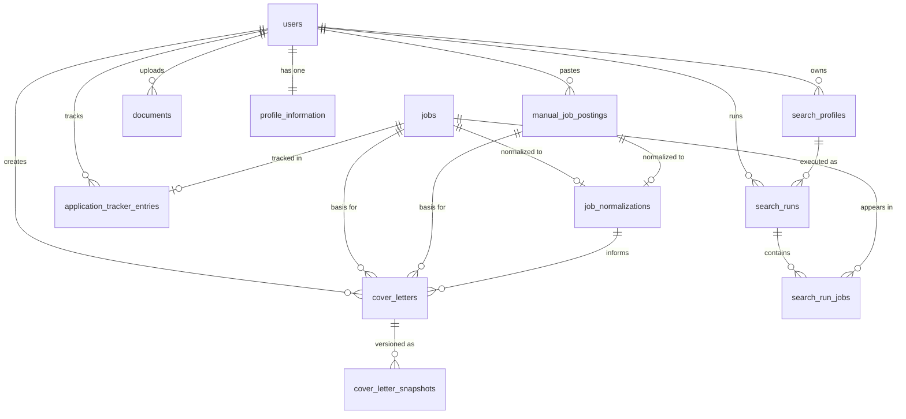

# 08 — Database Analysis

> **Related documents:** [02-architecture.md](02-architecture.md) | [assets/er-diagram.md](assets/er-diagram.md)

---

## Database Type

**PostgreSQL 16** — Relational database with extensions:
- `JSONB` columns for flexible structured data (cover letter content, layout settings, normalization output, profile JSON sub-objects)
- **Array columns** (PostgreSQL-native `ARRAY(String)`) for multi-value filter fields (`employment_types`, `experience_levels`)

**ORM:** SQLAlchemy 2.0 (declarative style)
**Migrations:** Alembic 1.18.4, `--autogenerate` from model changes

---

## Schema Overview

**13 tables** across 15 migrations.

---

## Table Descriptions

### `users`
Core authentication and account table.

| Column | Type | Notes |
|---|---|---|
| id | INTEGER PK | Auto-increment |
| email | VARCHAR UNIQUE | Login identifier |
| password_hash | VARCHAR | bcrypt hash |
| role | VARCHAR | e.g., `user`, future: `admin` |
| trial_job_searches_left | INTEGER | Rate limiting counter |
| is_active | BOOLEAN | Account status |
| created_at | TIMESTAMP | Account creation |
| updated_at | TIMESTAMP | Last modification |

**Source:** `app/models/user.py`, migration `61de0767cd5a`

---

### `search_profiles`
Reusable, named sets of job search filter parameters.

| Column | Type | Notes |
|---|---|---|
| id | INTEGER PK | |
| user_id | INTEGER FK → users | CASCADE DELETE |
| profile_name | VARCHAR | Unique per user (UQ: user_id + profile_name) |
| query | VARCHAR | Search keywords |
| location | VARCHAR | Geographic filter |
| remote_only | BOOLEAN | Filter for remote jobs |
| employment_types | ARRAY(VARCHAR) | e.g., `[FULL_TIME, PART_TIME]` |
| experience_levels | ARRAY(VARCHAR) | e.g., `[more_than_3_years_experience]` |
| radius_km | INTEGER | Location radius |
| created_at, updated_at | TIMESTAMP | |

**Source:** `app/models/search_profile.py`, migrations `b8043c162ef4`, `a0ed68e39a26`, `361bc55a5937`

---

### `search_runs`
One execution of a search profile. Stores a snapshot of the profile state at run time.

| Column | Type | Notes |
|---|---|---|
| id | INTEGER PK | |
| user_id | INTEGER FK → users | |
| search_profile_id | INTEGER FK → search_profiles | |
| query_snapshot | VARCHAR | Profile state at run time |
| location_snapshot | VARCHAR | |
| remote_only_snapshot | BOOLEAN | |
| employment_types_snapshot | ARRAY(VARCHAR) | |
| experience_levels_snapshot | ARRAY(VARCHAR) | |
| run_date | DATE | UTC date of run |
| date_posted | VARCHAR | Filter used: today / three_days / week / month |
| current_page | INTEGER | Last loaded page number |
| total_jobs_loaded | INTEGER | Total results fetched |
| total_new_jobs_loaded | INTEGER | Not previously seen |
| can_load_more | BOOLEAN | Whether provider has more pages |
| created_at, updated_at | TIMESTAMP | |

**Unique constraint:** `(user_id, search_profile_id, run_date)` — one run per profile per day.

**Source:** `app/models/search_run.py`, migrations `b8043c162ef4`, `40a52200c2ff`

---

### `jobs`
Normalised job postings from the search API or manual input.

| Column | Type | Notes |
|---|---|---|
| id | INTEGER PK | |
| external_job_id | VARCHAR | Provider's ID |
| source | VARCHAR | e.g., `jsearch` |
| title | VARCHAR | Job title |
| company | VARCHAR | |
| company_logo | VARCHAR | URL |
| location | VARCHAR | |
| is_remote | BOOLEAN | |
| employment_type | VARCHAR | |
| job_url | VARCHAR | External link |
| description | TEXT | Full job description text |
| published_at | TIMESTAMP | |
| imported_at | TIMESTAMP | |

**Unique constraint:** `(external_job_id, source)` — prevents duplicate imports.

**Source:** `app/models/job.py`, migration `a80bd5ec14bd`

---

### `search_run_jobs`
Join table linking jobs to the search runs they appeared in.

| Column | Type | Notes |
|---|---|---|
| id | INTEGER PK | |
| search_run_id | INTEGER FK → search_runs | CASCADE DELETE |
| job_id | INTEGER FK → jobs | |
| is_previously_seen | BOOLEAN | Was this job in a prior run? |
| page_number | INTEGER | Which page it was fetched from |
| result_position | INTEGER | Position in result set |
| created_at | TIMESTAMP | |

**Unique constraint:** `(search_run_id, job_id)` — no duplicate job in same run.

**Source:** `app/models/search_run_job.py`

---

### `job_normalizations`
Stores the structured LLM output from job normalization.

| Column | Type | Notes |
|---|---|---|
| id | INTEGER PK | |
| job_id | INTEGER FK → jobs | SET NULL on job delete; nullable |
| manual_job_posting_id | INTEGER FK → manual_job_postings | SET NULL; nullable |
| normalized_data | JSONB | Full `JobNormalizationSchema` as JSON |
| llm_model | VARCHAR | Model used (e.g., `gpt-5-mini`) |
| created_at, updated_at | TIMESTAMP | |

One normalization per job or manual posting. JSONB enables schema-free storage of LLM output that evolves over time.

**Source:** `app/models/job_normalization.py`

---

### `manual_job_postings`
Raw job description text pasted by the user (not from the search API).

| Column | Type | Notes |
|---|---|---|
| id | INTEGER PK | |
| user_id | INTEGER FK → users | CASCADE DELETE |
| title | VARCHAR | User-provided title |
| company | VARCHAR | User-provided company |
| raw_text | TEXT | Full pasted job description |
| created_at | TIMESTAMP | |

**Source:** `app/models/manual_job_posting.py`

---

### `application_tracker_entries`
Tracks the lifecycle of a job application.

| Column | Type | Notes |
|---|---|---|
| id | INTEGER PK | |
| user_id | INTEGER FK → users | CASCADE DELETE |
| job_id | INTEGER FK → jobs | |
| status | VARCHAR | `SAVED / APPLIED / INTERVIEW / OFFER / REJECTED / WITHDRAWN` |
| notes | TEXT | Free-text user notes |
| applied_at | TIMESTAMP | When status became APPLIED |
| interview_at | TIMESTAMP | When interview was scheduled |
| offer_at | TIMESTAMP | When offer was received |
| rejected_at | TIMESTAMP | When rejected |
| withdrawn_at | TIMESTAMP | When application withdrawn |
| created_at | TIMESTAMP | |

**Unique constraint:** `(user_id, job_id)` — one entry per user per job.

**Source:** `app/models/application_tracker_entry.py`, migrations `a80bd5ec14bd`, `4cd7a33a7b3f`

---

### `documents`
Uploaded files (primarily CV PDFs) and their extraction status.

| Column | Type | Notes |
|---|---|---|
| id | INTEGER PK | |
| user_id | INTEGER FK → users | CASCADE DELETE |
| document_type | VARCHAR | `CV / COVER_LETTER` |
| document_name | VARCHAR | Display name |
| original_filename | VARCHAR | Original upload filename |
| storage_key | VARCHAR UNIQUE | MinIO object key |
| mime_type | VARCHAR | |
| file_size_bytes | INTEGER | |
| processing_status | VARCHAR | `PENDING / PROCESSING / COMPLETED / FAILED` |
| extraction_method | VARCHAR | `EMBEDDED_TEXT / OCR / MARKDOWN` |
| extracted_text | TEXT | Full extracted CV text |
| extraction_error | VARCHAR | Error message if failed |
| created_at, updated_at | TIMESTAMP | |

**Source:** `app/models/document.py`, migrations `40c3e2ebdae9`, `6a1df5687881`

---

### `profile_information`
Structured candidate profile extracted from the CV by the LLM pipeline.

| Column | Type | Notes |
|---|---|---|
| id | INTEGER PK | |
| user_id | INTEGER FK → users UNIQUE | One profile per user |
| first_name, last_name | VARCHAR | |
| email, phone | VARCHAR | Contact details |
| street, city, location | VARCHAR | Address |
| target_role | VARCHAR | Desired job title |
| seniority_level | VARCHAR | |
| leadership_experience | BOOLEAN | |
| salary_expectation | VARCHAR | |
| work_model | VARCHAR | remote / hybrid / onsite |
| availability | VARCHAR | |
| employment_types | JSON | List |
| work_experience | JSON | List of experience dicts |
| education | JSON | List |
| certifications | JSON | List |
| projects | JSON | |
| soft_skills, hard_skills | JSON | Lists |
| languages | JSON | List with proficiency |
| publications, honors_awards | JSON | |
| volunteering, courses | JSON | |
| signature_image | TEXT | Base64-encoded image |
| cv_reconstruction | TEXT | Clean text from Step 1 |
| extraction_error | VARCHAR | |
| created_at, updated_at | TIMESTAMP | |

**Source:** `app/models/profile_information.py`, migrations `178cc82e23d3`, `73043a5d9a39`, `6996e8474a3c`

---

### `cover_letters`
Cover letter records including generation configuration, content, and layout.

| Column | Type | Notes |
|---|---|---|
| id | INTEGER PK | |
| user_id | INTEGER FK → users | CASCADE DELETE |
| job_id | INTEGER FK → jobs | SET NULL; nullable |
| manual_job_posting_id | INTEGER FK → manual_job_postings | SET NULL; nullable |
| job_normalization_id | INTEGER FK → job_normalizations | SET NULL; nullable |
| template | VARCHAR | `classic / modern / compact` |
| tone | VARCHAR | `formell / locker / sachlich / warm` |
| must_haves | TEXT | User constraints |
| no_gos | TEXT | Topics to exclude |
| personal_motivation | TEXT | |
| why_company | TEXT | |
| added_value | TEXT | |
| earliest_start_date | VARCHAR | |
| salary_expectation | VARCHAR | |
| industry_group | VARCHAR | |
| hierarchy_level | VARCHAR | |
| output_language | VARCHAR | `de / en` |
| company_context | TEXT | Background info for LLM |
| content | JSONB | `{subject_line, salutation, intro, body_qualifications, body_fit, conclusion}` |
| generation_status | VARCHAR | `PENDING / PROCESSING / COMPLETED / FAILED` |
| generation_error | TEXT | |
| document_name | VARCHAR | Display name |
| document_filename | VARCHAR | Download filename |
| is_saved | BOOLEAN | User marked as final |
| layout_settings | JSONB | `{theme, font, size, spacing, signature_space}` |
| created_at, updated_at | TIMESTAMP | |

**Source:** `app/models/cover_letter.py`, migrations `fa5fe069369e`, `1f45652f6313`, `c4a2f9d81e37`

---

### `cover_letter_snapshots`
Immutable content version history for cover letters.

| Column | Type | Notes |
|---|---|---|
| id | INTEGER PK | |
| cover_letter_id | INTEGER FK → cover_letters | CASCADE DELETE |
| content | JSONB | Snapshot of content at this point in time |
| revision_type | VARCHAR | `INITIAL / AI_REVISION / USER_REVISION` |
| version_number | INTEGER | Auto-incremented within a cover letter |
| created_at | TIMESTAMP | |

**Source:** `app/models/cover_letter_snapshot.py`

---

## Entity Relationship Diagram

*(Full annotated ER diagram: [assets/er-diagram.md](assets/er-diagram.md))*

---

## Relationship Explanations

| Relationship | Type | Notes |
|---|---|---|
| user → search_profiles | One-to-many | Cascade delete |
| user → search_runs | One-to-many | Via user_id directly |
| search_profile → search_runs | One-to-many | Profile executions over time |
| search_run → search_run_jobs | One-to-many | Jobs in this run |
| job → search_run_jobs | Many-to-many (via join) | Jobs can appear in multiple runs |
| job → job_normalizations | One-to-one | One normalization per job |
| manual_job_posting → job_normalizations | One-to-one | Same normalization schema |
| user → profile_information | One-to-one | Single profile per user (UNIQUE FK) |
| job → application_tracker_entries | One-to-one per user | Unique(user_id, job_id) |
| cover_letter → cover_letter_snapshots | One-to-many | Immutable version history |

---

## Migration History

| Migration ID | Description |
|---|---|
| `a80bd5ec14bd` | Initial schema: users, jobs, application_tracker_entries |
| `b8043c162ef4` | Search profile and search run tables |
| `40a52200c2ff` | Add profile snapshot columns to search_runs |
| `40c3e2ebdae9` | Add documents table |
| `61de0767cd5a` | Rename password column; add role + trial_job_searches_left |
| `4cd7a33a7b3f` | Add status-specific dates to tracker; remove generic updated_at |
| `a0ed68e39a26` | Refactor search-profile filters: arrays instead of strings |
| `fa5fe069369e` | Add cover_letters + cover_letter_snapshots (initial) |
| `1f45652f6313` | Rework cover letter schema: layout_settings JSONB, tone refactor |
| `178cc82e23d3` | Add profile_information table |
| `73043a5d9a39` | Add signature_image to profile_information |
| `6996e8474a3c` | Add cv_reconstruction to profile_information |
| `6a1df5687881` | Add MARKDOWN extraction method |
| `c4a2f9d81e37` | Cover letter tone column: enum → TEXT |
| `361bc55a5937` | Unique constraint: (user_id, profile_name) on search_profiles |

---

## Data Flow

1. **Job ingestion:** Search API response → `job_search_response_mapper.py` → INSERT `jobs` (upsert on external_job_id+source) → INSERT `search_run_jobs`
2. **Job normalization:** Raw `jobs.description` → OpenAI → INSERT `job_normalizations.normalized_data` (JSONB)
3. **CV upload:** PDF bytes → MinIO → `documents` INSERT → background extraction → UPSERT `profile_information`
4. **Cover letter:** Setup form → INSERT `cover_letters` (PENDING) → background LLM pipeline → UPDATE `cover_letters` (content JSONB, COMPLETED) → INSERT `cover_letter_snapshots`
5. **Status tracking:** POST /tracker/{job_id}/status → UPSERT `application_tracker_entries`
