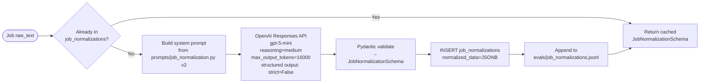

# 09 — AI System Analysis

> **Related documents:** [05-features.md](05-features.md) | [14-engineering-decisions.md](14-engineering-decisions.md) | [assets/additional-diagrams.md](assets/additional-diagrams.md)

---

## AI Architecture Overview

AI Job Copilot integrates AI in three distinct pipelines, each serving a different purpose:

| Pipeline | Purpose | Model | Pattern |
|---|---|---|---|
| **Job Normalization** | Structured extraction from job descriptions | gpt-5-mini | Single structured output call |
| **Cover Letter Generation** | Personalised letter writing with compliance | gpt-5-mini | 3-call orchestrated pipeline |
| **CV Profile Extraction** | Structured candidate data from CV text | qwen2.5-7b (OpenRouter) | 2-step sequential pipeline |

There is no RAG system, no vector database, no embeddings, and no agent framework. Context is managed entirely through prompt engineering and structured outputs. All LLM outputs are validated through Pydantic schemas.

---

## AI Component 1: Job Normalization

### Purpose
Convert raw, unstructured job advertisement text into a consistent, machine-readable schema that powers downstream features (cover letter generation, job card display, keyword matching).

### Files
- `app/services/job_normalization_service.py`
- `prompts/job_normalization.py`
- `app/schemas/job_normalization.py`
- `app/crud/job_normalization.py`

### Inputs
- `raw_text` (str): Full job description from the API or user paste
- Optional hints from the `Job` ORM object: `company`, `location`, `employment_type` (provided to LLM for cross-validation)

### Process



### Output: `JobNormalizationSchema`

| Field | Type | Description |
|---|---|---|
| title | str | Canonical job title |
| title_variants | list[str] | Alternative titles |
| company | str | Company name |
| contact_person | str \| None | Hiring contact |
| contact_person_gender | str | `male / female / unknown` |
| location | str | Work location |
| reference_number | str \| None | Job reference |
| industry_group | str | `conservative_business / dynamic_modern / technical_scientific / social_health_education` |
| hierarchy_level | str | `entry_junior / professional_senior / executive_c_level` |
| role_summary | str | 2-3 sentence summary |
| responsibilities | list[str] | Core duties |
| required_competencies | list[str] | Must-have qualifications |
| nice_to_have_competencies | list[str] | Preferred qualifications |
| technical_skills | list[str] | Tools, languages, frameworks |
| ats_keywords | list[str] | Applicant tracking system keywords |
| ad_language | str | `de / en` |

### Caching
`get_or_create_normalization(job_id, db)` checks the database before calling the LLM. This prevents redundant API calls when the same job is analyzed multiple times or referenced by multiple cover letters.

### Eval Logging
Every call appends a JSONL record to `evals/job_normalizations.jsonl`:
```json
{
  "timestamp": "2025-06-10T12:00:00Z",
  "model": "gpt-5-mini",
  "prompt_version": "v2",
  "job_id": 42,
  "normalized_data": { ... }
}
```

### Prompt Engineering
- **Version v2** (active): Adds `contact_person_gender` extraction with escalation rules — prefers `unknown` over incorrect gender assignment
- **Rule-based constraints**: "Never infer or fabricate"; "Output in ad language, no translation"; "Null for missing optional fields, empty list for missing list fields"
- **Industry classification**: 4 fixed categories with example industries
- **Hierarchy classification**: 3 levels with distinguishing criteria

---

## AI Component 2: Cover Letter Generation

### Purpose
Produce a fully personalised, professionally written, tone-appropriate German business letter for a specific job application.

### Files
- `app/services/cover_letter_service.py`
- `prompts/cover_letter_generation.py` (908 lines)
- `app/schemas/cover_letter.py`

### Inputs
- Normalised job schema (`JobNormalizationSchema`)
- Candidate profile (filtered `ProfileInformation` — **contact fields excluded**)
- User configuration: tone, industry_group, hierarchy_level, output_language, must_haves, no_gos, personal_motivation, why_company, added_value, salary_expectation, earliest_start_date, company_context

### The 3-Call Pipeline

```mermaid
flowchart TD
    A([Inputs]) --> CALLA

    subgraph CALLA ["Call A — Analysis"]
        direction LR
        A1[gpt-5-mini\nreasoning=medium\nmax_tokens=5000]
        A2["Output: fit_plan\n• supported_ats_keywords\n• missing_requirements + strategies\n• evidence_points\n• company_fit_angle\n• candidate_value_proposition\n• must_include / must_avoid\n• salary_line / start_date_line"]
    end

    CALLA --> CALLB

    subgraph CALLB ["Call B — Writing"]
        direction LR
        B1[gpt-5-mini\nreasoning=low\nmax_tokens=4000]
        B2["Output: 6 letter fields\n• subject_line\n• salutation\n• introduction\n• main_body_qualifications\n• main_body_fit\n• conclusion\n\n330–380 words\nhard max 2300 chars"]
    end

    CALLB --> LENCHECK{Length\n≤ 2300 chars?}
    LENCHECK -- No --> RETRY_B[Compress retry\nCall B]
    RETRY_B --> CALLC
    LENCHECK -- Yes --> CALLC

    subgraph CALLC ["Call C — Verification"]
        direction LR
        C1[gpt-5-mini\nreasoning=low\nmax_tokens=2000]
        C2["Output: violations list\n• topic violated\n• evidence sentence\n• paraphrase/euphemism flag"]
    end

    CALLC --> VIOLATIONS{Violations?}
    VIOLATIONS -- No --> INJECT
    VIOLATIONS -- Yes --> REMEDIAL[Remedial Call B\nwith avoid-list]
    REMEDIAL --> INJECT

    subgraph INJECT ["Post-LLM Contact Injection"]
        I1["Add: first_name, last_name\nemail, phone, street, city\nsignature_image"]
        I2["(Never sent to LLM)"]
    end

    INJECT --> SAVE["UPDATE cover_letters\n(COMPLETED, content JSONB)"]
```



### Call A — Analysis Detail

**System prompt:** Senior HR expert perspective. Evaluates fit between job requirements and candidate profile.

**Input context includes:**
- Full normalized job schema (filtered via `filter_job_for_llm()` — removes backend-only fields)
- Candidate profile dict (contact fields excluded)
- User tone, industry, hierarchy selections
- Optional: why_company, personal_motivation, added_value, company_context

**Missing requirements strategies** (for gaps in candidate profile):
- `interface`: candidate worked at the boundary of this skill
- `goal`: candidate is actively developing this skill
- `theory`: candidate has academic knowledge
- `transferable`: related skill applies
- `willingness_to_learn`: explicit openness

**Truth principle:** "Never invent, extract only from provided data. If evidence is absent, use missing_requirements."

### Call B — Writing Detail

**Tone configurations** (from `prompts/cover_letter_generation.py`):
| Tone | Style | Key Features |
|---|---|---|
| `formell` | Formal business German | Sie-form, passive constructions, Konjunktiv |
| `sachlich` | Factual/neutral | Direct, evidence-focused, minimal adjectives |
| `warm` | Warm/personal | Personal voice, moderate enthusiasm |
| `locker` | Casual/modern | Colloquial phrasing, energetic, startup-friendly |

**Industry group configurations** (4 groups, each has):
- `key_emphasis`: primary selling points to stress
- `acceptable_self_positioning`: how boldly to self-promote
- `lexicon`: preferred vocabulary
- `no_gos`: forbidden phrases or styles

**Hierarchy level configurations** (3 levels):
- `entry_junior`: focus on potential, willingness to learn, team fit
- `professional_senior`: evidence-based, metrics, specific achievements
- `executive_c_level`: strategic vision, leadership narrative, impact

**Length enforcement:**
- Target: 330–380 words / 1800–2300 characters
- One automatic retry with compression instruction if limit exceeded

### Call C — Verification Detail

**Purpose:** Compliance auditing. Detects no-go topic violations including:
- Direct mentions
- Paraphrases
- Euphemisms
- Indirect allusions

Returns a list of `{topic, evidence_sentence}` violations. If violations are found, Call B is re-run once with an explicit `avoid_list` injected into the prompt.

**One-pass limit:** If the remedial regeneration still has violations, they are accepted (no infinite loop).

### Gender-Safe Salutation

The salutation is constructed with a cascade:
1. Try honorific extraction from name ("Herr"/"Frau" prefix)
2. Check `contact_person` field from job normalization
3. If present, use `contact_person_gender` from normalization (male/female/unknown)
4. Fallback: `gender_guesser` library (name → gender)
5. Final fallback: `unknown` → gender-neutral salutation ("Sehr geehrte Damen und Herren")

**Source:** `resolve_contact_gender()` in `prompts/cover_letter_generation.py`

### Privacy by Design

Private contact data (name, email, phone, address, signature image) is explicitly withheld from all LLM calls. It is injected into the `content` JSONB **after** all AI calls complete. This design ensures:
- No personal data leaves the application to OpenAI's API
- Contact fields are always accurate (not hallucinated by the LLM)

---

## AI Component 3: CV Profile Extraction

### Purpose
Parse a raw CV PDF into a structured candidate profile that powers contact pre-population and personalised cover letter generation.

### Files
- `app/services/profile_extraction.py`
- `prompts/profile_extraction.py`
- `prompts/profile_extraction_step1.py`
- `app/schemas/profile.py` (`CandidateProfile`)

### Why Two Steps?

Raw PDF text is often poorly formatted (broken lines, garbled order, mixed fonts). Asking an LLM to both restructure and extract in one pass produces lower-quality structured output. The two-step approach:

1. **Step 1 (reconstruction):** Focus solely on producing clean, well-structured plain text
2. **Step 2 (extraction):** Focus solely on mapping clean text to a schema

This mirrors a human expert workflow: read and organise first, then extract.

### Step 1 — Text Reconstruction

**Model:** `qwen2.5-7b-instruct` via OpenRouter
**Prompt version:** `step1_v1`
**Task:** Rewrite raw CV text as clean, structured plain text grouped by standard sections (Personal Information, Work Experience, Education, Skills, Languages, Certifications, Projects, Volunteering, Publications, Honors & Awards, Preferences)
**Constraint:** Preserve all information exactly — no additions, no omissions
**Output:** Plain text (no schema enforcement)

### Step 2 — Structured Extraction

**Model:** `qwen2.5-7b-instruct` via OpenRouter
**Prompt version:** `step2_v3`
**Method:** `beta.chat.completions.parse` with `CandidateProfile` Pydantic schema
**Task:** Map clean text → typed `CandidateProfile` fields

**`CandidateProfile` fields:**
- Contact: `first_name`, `last_name`, `email`, `phone`, `street`, `city`, `location`
- Professional: `target_role`, `seniority_level`, `leadership_experience`, `salary_expectation`, `work_model`, `availability`
- History: `work_experience[]`, `education[]`, `certifications[]`, `projects[]`, `courses[]`, `volunteering[]`
- Skills: `soft_skills[]`, `hard_skills[]`, `languages[]`
- Other: `publications[]`, `honors_awards[]`, `employment_types[]`

**Prompt v3 specifics:**
- German output for all descriptive fields
- Handles compound surnames, multi-part names
- Explicit rules for German address format

### Eval Logging
Outputs appended to `evals/profile_extractions.jsonl` with timestamp, model, versions, user_id.

---

## Context Management

There is no vector database, embedding index, or retrieval-augmented generation. Context is assembled in-memory for each LLM call:

| What | How Context Is Managed |
|---|---|
| Job data | Loaded from DB, passed as a JSON dict in the prompt |
| Candidate profile | Loaded from DB, serialised (contact fields excluded) |
| Fit plan (Call A output) | Passed as-is into Call B/C prompts |
| Prompt versioning | Functions `VERSIONS` dict in each prompt module; current version selected at call time |

---

## Model Provider Summary

| Model | Provider | Usage | Config |
|---|---|---|---|
| `gpt-5-mini` | OpenAI API | Job normalization + cover letter generation | Responses API, structured output |
| `qwen2.5-7b-instruct` | OpenRouter | CV extraction (Step 1 + 2) | beta.chat.completions.parse |
| `qwen2.5:7b` | Ollama (local) | CV extraction (experimental fallback) | Local endpoint `http://localhost:11434/v1` |

---

## Prompt Engineering Patterns

| Pattern | Where Used | Description |
|---|---|---|
| Versioned prompts | All prompt files | `VERSIONS` dict; new prompt text = new version key; old versions preserved |
| Structured output | Job normalization, CV Step 2 | Schema enforced via OpenAI's `text.format` or `beta.parse`; Pydantic validates |
| Role persona | Cover letter Call A | "You are a senior HR expert and cover letter specialist..." |
| Truth constraints | Normalization, Call A | "Never infer or fabricate. If evidence is absent, state so explicitly." |
| Multi-step decomposition | Cover letter, CV extraction | Complex task split into focused sub-calls |
| Retry logic | Cover letter Call B | One automatic length-compression retry |
| Remedial pass | Cover letter Call C | One compliance-fixing Call B if violations found |
| Hint injection | Normalization | API-provided company/location hints passed to LLM for cross-check |
| Privacy separation | Cover letter | Contact fields never included in LLM calls; injected post-generation |
| Eval logging | Normalization, extraction | JSONL audit trail for monitoring model output quality |

---

## AI Limitations and Risks

| Risk | Description | Mitigation |
|---|---|---|
| Hallucination | LLM may generate false claims about candidate | "Never invent" rule in prompts; evidence-based approach in Call A |
| Contact data leakage | Private data sent to cloud LLM | Architecture-level: contact fields never included in prompts |
| Model dependency | Single provider (OpenAI) for critical path | Local Ollama support exists (partial) |
| Token limits | Very long CVs or job descriptions may exceed context | max_output_tokens caps enforced; extraction split across two models |
| Compliance violation misses | Call C may not catch all violations | One remedial pass; acknowledged limitation |
| Stale caching | Cached normalization may be outdated if job changes | Cache is per-job-id; no invalidation; acceptable for prototype |
