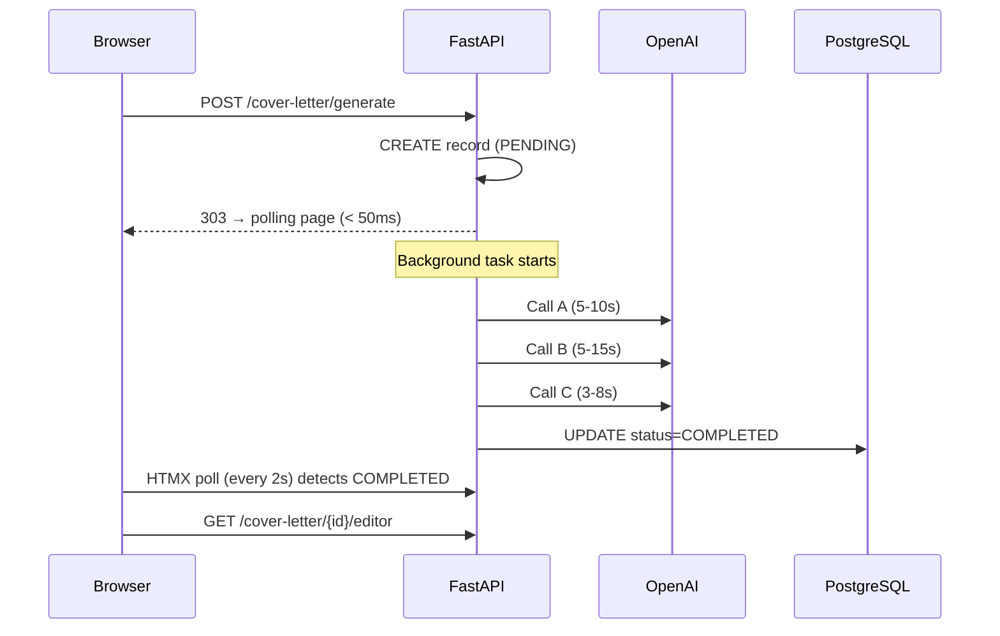

# 13 — Performance and Scalability

> **Related documents:** [02-architecture.md](02-architecture.md) | [15-future-improvements.md](15-future-improvements.md)

---

## Performance Characteristics

### Request Latency Profile

| Request Type | Expected Latency | Bottleneck |
|---|---|---|
| Page load (no AI) | 50–200 ms | DB query + Jinja2 render |
| Job search (live API) | 2–8 seconds | RapidAPI network call |
| Job search (fixture) | <100 ms | No external call |
| Job normalization | 3–10 seconds | Single OpenAI call |
| Cover letter generation | 15–60 seconds | 3–5 sequential OpenAI calls |
| CV extraction | 5–20 seconds | 2 sequential OpenRouter calls |
| Cover letter editor preview | 100–300 ms | Server-side Jinja2 re-render |
| PDF export | 500ms–2s | WeasyPrint HTML→PDF conversion |

---

## Background Task Architecture

Long-running AI operations are deferred to FastAPI's `BackgroundTasks`, preventing the HTTP response from blocking on LLM latency:



**Key limitation:** `BackgroundTasks` run in the same process as the request handler. Under load, many concurrent background tasks share the same thread pool. There is no persistence — a server restart drops all in-flight tasks.

---

## LLM Performance Analysis

### Sequential Calls (Cover Letter)

The 3–5 OpenAI calls in the cover letter pipeline are **sequential**, not parallel. Each call depends on the output of the previous one (Call B needs Call A's `fit_plan`; Call C needs Call B's letter text). This sequential dependency is inherent in the algorithm.

**Current worst case:** Analysis + Writing + Verification + (optional compress retry) + (optional remedial writing) = up to 5 calls × ~10s average = **up to 50 seconds**.

**Optimisation opportunities:**
- Call A (Analysis) could run in parallel with job normalization if the job is not yet normalised (they don't depend on each other)
- The verification step (Call C) could be made optional for users who want faster generation

### LLM Caching (Job Normalization)

`get_or_create_normalization()` checks the database before calling OpenAI. This is a simple but effective cache:
- A job normalised once is never normalised again
- Cover letters for the same job reuse the cached normalization instantly
- **Cache granularity:** Per job_id or per manual_job_posting_id

There is no TTL — cached normalizations are permanent. This is acceptable because job descriptions don't change.

---

## Database Performance

### Current Query Patterns

| Operation | Table | Query Type | Notes |
|---|---|---|---|
| Session validation | users | `SELECT WHERE id=?` | Every authenticated request; indexed by PK |
| Search run lookup | search_runs | `SELECT WHERE user_id + date + profile_id` | Unique constraint creates implicit index |
| Job upsert | jobs | `INSERT ON CONFLICT (external_job_id, source)` | Unique index used |
| Normalization cache | job_normalizations | `SELECT WHERE job_id=?` | FK index |
| Profile load | profile_information | `SELECT WHERE user_id=?` | Unique FK index |

### Potential Bottlenecks

| Concern | Risk Level | Description |
|---|---|---|
| `extracted_text` column | Medium | Full CV text stored as TEXT in DB; large values inflate row size |
| `cv_reconstruction` column | Medium | Second copy of clean CV text; same row size concern |
| JSONB queries | Low | `normalized_data`, `content`, `layout_settings` stored as JSONB; not queried by field currently (acceptable) |
| N+1 queries | Potential | If tracker or jobs list loads relationships lazily (needs profiling) |
| No DB query profiling | Unknown | No slow query log or query analysis tooling configured |

### Recommendations

- Add PostgreSQL `pg_stat_statements` to track slow queries
- Index `search_runs.run_date` for dashboard stats queries
- Consider moving `extracted_text` and `cv_reconstruction` to a separate table or storing in MinIO

---

## Caching

| Layer | Cache Present | Type |
|---|---|---|
| Job normalization | Yes | DB-level (per job_id) |
| Search run (today) | Yes | DB-level (one run per profile per day) |
| HTTP response | No | No `Cache-Control` headers, no CDN |
| Template rendering | No | Jinja2 renders on every request (no fragment caching) |
| Session data | Partial | Signed cookie — no server-side cache needed |

---

## Network Efficiency

- **HTMX polling:** 1 GET request every 2 seconds during background task waiting. For a 30-second cover letter generation, this is ~15 extra requests. Low overhead — responses are tiny HTML fragments.
- **Live preview (editor):** Every design control change triggers an HTMX GET. If the user adjusts 5 settings rapidly, 5 requests fire in sequence. HTMX's default behaviour cancels pending requests on new trigger — only the last request completes.
- **MinIO downloads:** Served via presigned URLs. The browser downloads directly from MinIO, not through the FastAPI app, reducing app server load.

---

## Scalability Analysis

### Current Single-Process Architecture

```
Browser → Uvicorn (single process) → PostgreSQL
                                   → MinIO
                                   → OpenAI
                                   → RapidAPI
```

### Scaling Path

| Dimension | Current Limit | Horizontal Scaling Option |
|---|---|---|
| Web workers | 1 (Uvicorn dev mode) | Gunicorn multi-worker; each worker stateless |
| Background tasks | In-process; no queue | Celery + Redis for distributed task workers |
| Database | Single write + read | PgBouncer connection pooling; read replicas for dashboard queries |
| LLM throughput | Sequential, single user at a time | OpenAI batch API for bulk normalization; async concurrent calls |
| Object storage | MinIO (single node) | AWS S3 (same boto3 API; drop-in replacement) |

### Statelessness of Routes

All route handlers are stateless (no in-memory state). Session data is in the signed cookie. This means horizontal scaling (multiple Uvicorn workers) is possible without sticky sessions — any worker can handle any request.

**Exception:** `BackgroundTasks` are in-process. Scaling to multiple workers means a background task started by worker 1 cannot be monitored by worker 2. This would require migrating to an external task queue before scaling.

---

## AI Cost Analysis

| Operation | Model | Estimated Tokens | Estimated Cost (approx.) |
|---|---|---|---|
| Job normalization (per job) | gpt-5-mini | ~3,000–8,000 | $0.002–0.006 |
| Cover letter analysis | gpt-5-mini | ~2,000–4,000 | $0.001–0.003 |
| Cover letter writing | gpt-5-mini | ~1,000–3,000 output | $0.002–0.005 |
| Cover letter verification | gpt-5-mini | ~1,000–2,000 | $0.001–0.002 |
| CV extraction step 1 | qwen2.5 (OpenRouter) | ~2,000–5,000 | $0.0005–0.001 |
| CV extraction step 2 | qwen2.5 (OpenRouter) | ~2,000–4,000 | $0.0005–0.001 |

**Caching impact:** Job normalization is cached. For a user who generates 5 cover letters for the same job, the normalization cost is paid once.

**Note:** Exact pricing depends on model pricing at time of use. gpt-5-mini pricing not confirmed here — verify with OpenAI's current rate card.
