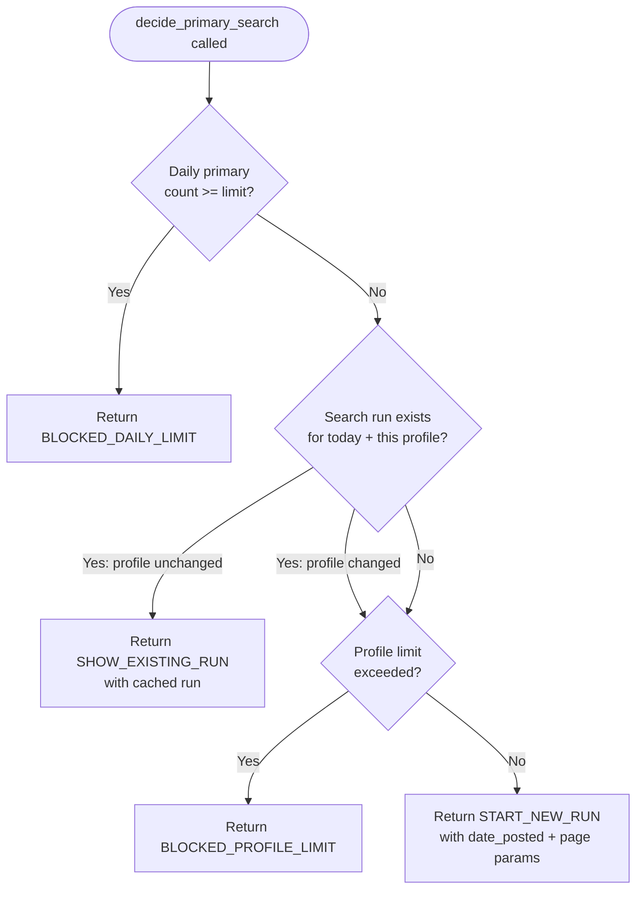
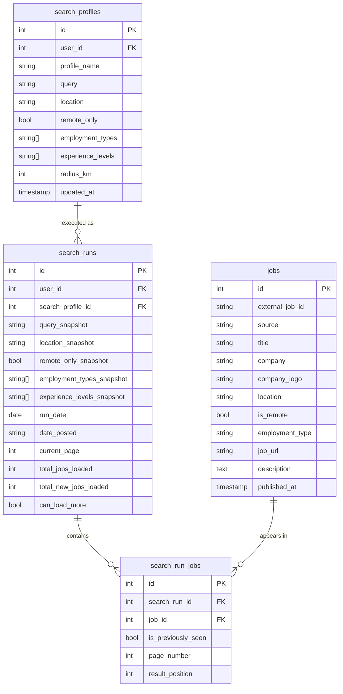
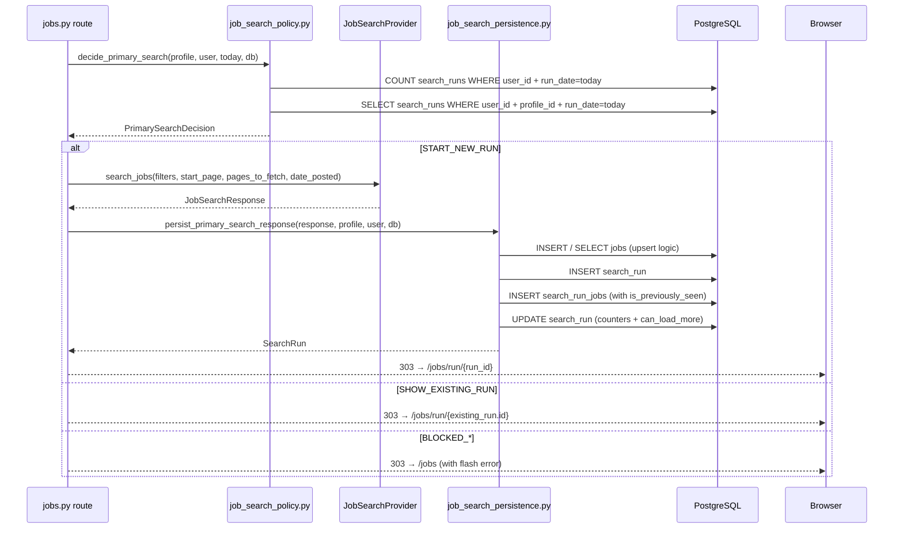

# 20 — Job Search Subsystem Analysis

> **Related documents:** [02-architecture.md](02-architecture.md) | [07-api-analysis.md](07-api-analysis.md) | [08-database-analysis.md](08-database-analysis.md) | [11-engineering-practices.md](11-engineering-practices.md)

---

## Overview

The job search subsystem is the entry point of the application's core workflow. It allows users to execute profile-based job searches against an external API (or local fixture data), persists results to the database, and enforces usage policies. It is designed around a **Strategy pattern** so that the live API call path and the development mock path are interchangeable behind a shared protocol interface.

The subsystem spans seven distinct files in the service layer, a dedicated route module, three CRUD modules, four ORM models, one schema module, and two Jinja2 templates.

---

## Subsystem Components

| Component | File | Responsibility |
|---|---|---|
| **Protocol definition** | `app/services/job_search_provider.py` | Defines the `JobSearchProvider` interface both providers implement |
| **Live provider** | `app/services/live_job_search_provider.py` | Calls the external RapidAPI/JSearch endpoint via `httpx` |
| **Fixture provider** | `app/services/fixture_job_search_provider.py` | Loads a pre-recorded response from `fixtures/job_search_response.json` |
| **Request mapper** | `app/services/job_search_request_mapper.py` | Translates `SearchProfileBase` → upstream API query parameters |
| **Response mapper** | `app/services/job_search_response_mapper.py` | Translates the raw API JSON payload → internal `JobSearchResponse` schema |
| **Policy engine** | `app/services/job_search_policy.py` | Decides whether to start a new run, show a cached run, or block the request |
| **Persistence service** | `app/services/job_search_persistence.py` | Writes search run, job, and join-table records to the database |
| **Route handler** | `app/api/routes/jobs.py` | HTTP entry points: search, load-more, run detail, history |
| **DI factory** | `app/dependencies/providers.py` | Constructs and injects the correct provider at startup |

---

## Architecture: Provider Strategy Pattern

```mermaid
graph TD
    Route["app/api/routes/jobs.py\n(route handler)"]
    DI["app/dependencies/providers.py\nget_job_search_provider()"]
    Protocol["JobSearchProvider\n(Protocol interface)"]
    Live["LiveJobSearchProvider\nsearch_jobs()"]
    Fixture["FixtureJobSearchProvider\nsearch_jobs()"]
    API["RapidAPI / JSearch\nhttps://.../search"]
    Fixture_File["fixtures/job_search_response.json\n(251 KB pre-recorded payload)"]
    Mapper["job_search_response_mapper.py\nmap_payload_to_job_search_response()"]

    DI -->|JOB_SEARCH_PROVIDER=live| Live
    DI -->|JOB_SEARCH_PROVIDER=fixture| Fixture
    Route -->|Depends| DI
    DI --> Protocol
    Live -->|implements| Protocol
    Fixture -->|implements| Protocol
    Live -->|httpx GET /search| API
    API --> Mapper
    Fixture -->|json.load()| Fixture_File
    Fixture_File --> Mapper
```

The route handler receives a `JobSearchProvider` instance — it never imports `LiveJobSearchProvider` or `FixtureJobSearchProvider` directly. Swapping providers requires only changing the `JOB_SEARCH_PROVIDER` environment variable.

---

## Provider Protocol

**File:** `app/services/job_search_provider.py`

```python
class JobSearchProvider(Protocol):
    def search_jobs(
        self,
        filters: SearchProfileBase,
        *,
        start_page: int,
        pages_to_fetch: int,
        date_posted: str
    ) -> JobSearchResponse: ...
```

The `Protocol` type (Python's structural subtyping) means `LiveJobSearchProvider` and `FixtureJobSearchProvider` do not need to explicitly inherit from `JobSearchProvider`. They satisfy the protocol simply by implementing a `search_jobs` method with the correct signature. This is duck-typing with type-checker enforcement.

---

## Provider Selection and DI Factory

**File:** `app/dependencies/providers.py`

```python
def get_job_search_provider() -> JobSearchProvider:
    settings = get_settings()
    if settings.job_search_provider == "fixture":
        return FixtureJobSearchProvider()
    elif settings.job_search_provider == "live":
        client = get_job_search_api_client()
        return LiveJobSearchProvider(client=client)
    raise ValueError(f"Unsupported job search provider: {settings.job_search_provider}")
```

The `httpx.Client` for the live provider is constructed here with:
- `base_url`: from `JOB_API_BASE_URL` env var
- `timeout`: four independent timeout values (connect, read, write, pool) from separate env vars
- **Headers** passed at client level (applied to every request):
  - `x-rapidapi-key`: the API authentication key
  - `x-rapidapi-host`: the API host header (required by RapidAPI)
  - `Content-Type: application/json`

Settings are cached via `@lru_cache` on `get_settings()` — the factory runs once per process lifetime, not once per request.

---

## Live Provider: The External API Call

**File:** `app/services/live_job_search_provider.py`

```python
def search_jobs(
    self,
    filters: SearchProfileBase,
    *,
    start_page: int,
    pages_to_fetch: int,
    date_posted: str
) -> JobSearchResponse:
    params = build_job_search_request_params(
        filters=filters,
        start_page=start_page,
        pages_to_fetch=pages_to_fetch,
        date_posted=date_posted
    )
    response = self._client.get("/search", params=params)
    response.raise_for_status()
    payload = response.json()
    return map_payload_to_job_search_response(payload)
```

The implementation is deliberately minimal — it delegates parameter construction to the request mapper and response normalisation to the response mapper. The provider itself only handles:
1. Building the URL and params
2. Executing the synchronous HTTP GET via `httpx.Client`
3. Raising on non-2xx responses (`raise_for_status()`)
4. Delegating JSON parsing to the mapper

**API endpoint:** `GET {JOB_API_BASE_URL}/search`
**Provider:** RapidAPI — JSearch (`jsearch.p.rapidapi.com`)

---

## Request Mapper: Filters → API Parameters

**File:** `app/services/job_search_request_mapper.py`

Translates a validated `SearchProfileBase` Pydantic object plus pagination/date context into a flat dictionary of query string parameters accepted by the JSearch API.

### Mapping Logic

| Internal Field | API Parameter | Transformation |
|---|---|---|
| `filters.query` + `filters.location` | `query` | If location is "deutschland"/"germany" (case-insensitive), sends query only. Otherwise: `"{query} in {location}"` |
| `start_page` | `page` | Direct cast to string |
| `pages_to_fetch` | `num_pages` | Direct cast to string |
| *(hardcoded)* | `country` | Always `"de"` (Germany) |
| `date_posted` | `date_posted` | Passed through from policy decision |
| `filters.remote_only` | `work_from_home` | Only included if `True`; value `"true"` |
| `filters.employment_types` | `employment_types` | Comma-joined list (e.g., `"FULLTIME,PARTTIME"`) — only if list is non-empty |
| `filters.experience_levels` | `job_requirements` | Comma-joined list — only if list is non-empty |
| `filters.radius_km` | `radius` | Direct cast to string — only if not `None` |

### Location Normalisation

The mapper applies special handling for Germany-wide searches: if the user's location field is `"deutschland"` or `"germany"` (any casing), the location is not appended to the query string — the `country=de` parameter already restricts to Germany. For city-level searches (e.g., `"Berlin"`), the query becomes `"Software Engineer in Berlin"`.

### Employment Type Values

The `employment_types` parameter maps directly to the JSearch API's accepted values, which are stored as Python enums in `app/core/enums.py`:

| Enum | API Value |
|---|---|
| `EmploymentType.FULL_TIME` | `FULLTIME` |
| `EmploymentType.PART_TIME` | `PARTTIME` |
| `EmploymentType.CONTRACTOR` | `CONTRACTOR` |
| `EmploymentType.INTERNSHIP` | `INTERN` |

### Experience Level Values

The `job_requirements` parameter maps to JSearch-accepted values:

| Enum | API Value |
|---|---|
| `ExperienceLevel.under_3_years_experience` | `under_3_years_experience` |
| `ExperienceLevel.more_than_3_years_experience` | `more_than_3_years_experience` |
| `ExperienceLevel.no_experience` | `no_experience` |
| `ExperienceLevel.no_degree` | `no_degree` |

---

## Response Mapper: API Payload → Internal Schema

**File:** `app/services/job_search_response_mapper.py`

Takes the raw JSON dictionary returned by the JSearch API and produces a `JobSearchResponse` Pydantic object containing a list of normalised `JobSearchResult` instances.

### `JobSearchResponse` Schema

```python
class JobSearchResult(BaseModel):
    external_job_id: str
    published_at: datetime | None = None
    title: str
    company: str
    company_logo: str | None = None
    location: str | None = None
    employment_type: str | None = None
    is_remote: bool | None = None
    description: str | None = None
    source: str | None = None
    job_url: str

class JobSearchResponse(BaseModel):
    results: list[JobSearchResult] = Field(default_factory=list)
    total: int = 0
```

**Source:** `app/schemas/job_search_results.py`

### Mapping Details

The mapper:
- Iterates over the `data` array in the API response
- Extracts fields using the JSearch field names (e.g., `job_id`, `employer_name`, `job_title`, `job_apply_link`, `job_description`)
- Sets `source` to the provider identifier (e.g., `"jsearch"`)
- Handles missing optional fields with `None` defaults
- Populates `total` from the API's `num_pages` or estimated count field
- Both `LiveJobSearchProvider` and `FixtureJobSearchProvider` call the same mapper, ensuring consistent internal representation regardless of how the data was obtained

---

## Fixture Provider: Development Mock

**File:** `app/services/fixture_job_search_provider.py`
**Data:** `fixtures/job_search_response.json` (251 KB — a full pre-recorded API response)

The fixture provider:
- Accepts all the same parameters as the live provider (satisfying the protocol)
- Ignores all parameters — filters, page, date, etc. have no effect
- Loads the JSON file from disk on every call (`json.load()`)
- Passes the loaded dict directly to `map_payload_to_job_search_response()` — identical to the live path

The `fixtures/job_search_response.json` file is a real capture of a JSearch API response, giving realistic job data (titles, companies, descriptions, locations) for development and UI testing without incurring API costs.

**Why not cache the fixture in memory?** The provider is constructed fresh by the DI factory on each request (not a singleton), so caching in `__init__` would only persist within a single request lifetime anyway. The file read is acceptable for development.

---

## Policy Engine: Decision Logic

**File:** `app/services/job_search_policy.py`

The policy engine is the most complex non-AI service in the job search subsystem. It enforces usage limits, decides whether to use cached results, and controls pagination state.

### Primary Search Decision



### Decision Outcomes (`PrimarySearchAction` enum)

| Action | Meaning | HTTP Response |
|---|---|---|
| `START_NEW_RUN` | Execute a new API call | Provider called → results persisted → redirect to run view |
| `SHOW_EXISTING_RUN` | Return today's cached run | No API call → redirect to existing run view |
| `BLOCKED_DAILY_LIMIT` | Too many searches today | Flash error + redirect back |
| `BLOCKED_PROFILE_LIMIT` | Profile-level limit reached | Flash error + redirect back |

### Daily Limits (Current Values)

```python
MAX_PRIMARY_SEARCHES_PER_DAY = 100   # TODO: reduce to 5
MAX_LOAD_MORE_ACTIONS_PER_DAY = 100  # TODO: reduce to 15
```

The high placeholder values (100) are intentional during development — they ensure the limits are never hit unintentionally while building and testing. The TODO comments mark them for tightening before any production deployment.

### Profile Change Detection

```python
def _has_profile_changed_since_last_run(
    profile: SearchProfile,
    last_run: SearchRun
) -> bool:
    return profile.updated_at > last_run.created_at
```

If the user has edited their search profile since the last run was created (e.g., added a new employment type), the cached run is stale and a new search is initiated.

### Date-Posted Selection

The policy engine selects the `date_posted` parameter intelligently based on how many days have elapsed since the last run for this profile:

```python
def decide_date_posted(days_since_last_run: int) -> str:
    if days_since_last_run == 0:
        return "today"
    elif days_since_last_run <= 3:
        return "three_days"
    elif days_since_last_run <= 7:
        return "week"
    else:
        return "month"
```

This ensures that on the first ever search, or after a long absence, the API returns a broad result set. On the same day, only today's postings are fetched.

### Load-More Decisions

The policy also governs pagination via a separate `decide_load_more()` function:

```python
def decide_load_more(
    search_run: SearchRun,
    daily_load_more_count: int
) -> LoadMoreDecision:
    if daily_load_more_count >= MAX_LOAD_MORE_ACTIONS_PER_DAY:
        return LoadMoreDecision(allowed=False, message="Tageslimit erreicht.")
    if not search_run.can_load_more:
        return LoadMoreDecision(allowed=False, message="Keine weiteren Ergebnisse.")
    return LoadMoreDecision(
        allowed=True,
        next_page=search_run.current_page + 1,
        pages_to_fetch=1
    )
```

### Load-More Availability Evaluation

After each response (primary search or load-more), the policy evaluates whether further pagination should be offered:

| Scenario | Threshold | Effect on `can_load_more` |
|---|---|---|
| Primary search — too few total | `total_jobs_loaded < 50` | `False` |
| Primary search — too few new | `total_new_jobs_loaded < 15` | `False` |
| Load-more — too few total | `total_jobs_loaded < 10` | `False` |
| Load-more — too few new | `total_new_jobs_loaded < 3` | `False` |

These thresholds prevent showing a "load more" button when the next page would contain only a handful of results.

---

## Persistence Service

**File:** `app/services/job_search_persistence.py`

Writes the mapped API response to three tables in a single transaction. This is the only service layer file that owns a database transaction in the job search subsystem.

### `persist_primary_search_response()`

```mermaid
flowchart TD
    A([JobSearchResponse + profile + user + db]) --> B[Create or load SearchRun\nfor today + profile_id]
    B --> C[For each JobSearchResult in response]
    C --> D{Job already exists\nIN jobs table?\nexternal_job_id + source}
    D -->|Yes| E[Reuse existing Job record]
    D -->|No| F[INSERT new Job record]
    E --> G[Check: was job in\nany previous run for this user?]
    F --> G
    G -->|Previously seen| H[is_previously_seen = True]
    G -->|New to user| I[is_previously_seen = False]
    H --> J[INSERT search_run_jobs]
    I --> J
    J --> K{All results processed}
    K --> L[Update SearchRun counters:\ncurrent_page, total_jobs_loaded,\ntotal_new_jobs_loaded, can_load_more]
    L --> M[db.commit()]
    M --> N([Return SearchRun])
```

### Deduplication Logic

**Job-level deduplication:** The `jobs` table has a unique constraint on `(external_job_id, source)`. The persistence service uses an upsert-style lookup: if a job with the same external ID already exists in the database, the existing record is reused. This means the same job appearing in multiple search runs across days or profiles is stored only once.

**"Previously seen" flag:** For each job in the result set, the service checks whether a `search_run_job` record already exists for this user (across all their previous runs). If yes, `is_previously_seen = True`. This flag is displayed in the UI to help users distinguish genuinely new postings from ones they have already encountered.

**SearchRun counters updated on persistence:**
- `current_page`: last page number fetched
- `total_jobs_loaded`: cumulative count of jobs in this run
- `total_new_jobs_loaded`: count of jobs not previously seen by this user
- `can_load_more`: evaluated by the policy's threshold functions

---

## Data Model: The Four Tables



### Profile Snapshot Columns

The `search_runs` table stores a snapshot of all profile filter values at run time (`query_snapshot`, `location_snapshot`, `employment_types_snapshot`, etc.). This means the history page shows the exact filters used for each run — even if the profile was later edited. Without snapshots, editing a profile would silently alter the displayed history.

### Unique Constraints

| Table | Constraint | Business Rule |
|---|---|---|
| `jobs` | `(external_job_id, source)` | One DB record per unique job, regardless of how many runs it appears in |
| `search_runs` | `(user_id, search_profile_id, run_date)` | One run per profile per calendar day |
| `search_run_jobs` | `(search_run_id, job_id)` | A job cannot appear twice in the same run |

---

## Route Handler

**File:** `app/api/routes/jobs.py`

The route module exposes five endpoints for the job search feature:

| Route | Method | Handler | Description |
|---|---|---|---|
| `/jobs` | GET | `render_job_search_page` | Lists all search profiles with search and edit actions |
| `/jobs/search/{profile_id}` | POST | `run_job_search` | Executes a search (or returns cached run) |
| `/jobs/run/{run_id}` | GET | `render_search_run_detail_page` | Displays the results of a specific run |
| `/jobs/run/{run_id}/load-more` | POST | `load_more_jobs` | Fetches the next page of results |
| `/jobs/history` | GET | `render_search_run_history_page` | Lists all past runs for all profiles |

### `run_job_search` Flow (POST `/jobs/search/{profile_id}`)



### `load_more_jobs` Flow (POST `/jobs/run/{run_id}/load-more`)

1. Route fetches the existing `SearchRun` by ID (ownership verified: `user_id` must match)
2. Policy evaluates `decide_load_more(search_run, daily_load_more_count)`
3. If allowed: provider called with `start_page = current_page + 1`, `pages_to_fetch = 1`
4. Persistence service appends new jobs to the existing `search_run` record (same `search_run_id`)
5. `can_load_more` re-evaluated by threshold functions
6. Redirect back to the same run's detail page

---

## CRUD Layer

Three CRUD modules support the job search subsystem — all in `app/crud/`:

### `crud/job.py`
- `get_job_by_external_id(db, external_id, source)` — deduplication lookup
- `create_job(db, JobSearchResult)` — insert new job record
- `get_jobs_by_run_id(db, run_id)` — all jobs in a given run (for display)

### `crud/search_run.py`
- `get_or_create_search_run(db, user_id, profile_id, run_date)` — enforces the one-run-per-day rule
- `get_search_run_by_id(db, run_id)` — fetch run for display or load-more
- `update_search_run_counters(db, run, ...)` — update `current_page`, `total_jobs_loaded`, `total_new_jobs_loaded`, `can_load_more`
- `get_search_runs_for_user(db, user_id)` — history page query
- `count_runs_today(db, user_id)` — daily limit check (primary search)
- `count_load_more_today(db, user_id)` — daily limit check (load-more)

### `crud/search_run_job.py`
- `create_search_run_job(db, run_id, job_id, is_previously_seen, page, position)` — insert join record
- `job_seen_by_user(db, user_id, job_id)` — cross-run check for `is_previously_seen` flag

---

## Complete End-to-End Data Flow

```mermaid
flowchart TD
    A([User submits\nPOST /jobs/search/42]) --> B[get_current_user\nvalidate session]
    B --> C[Load SearchProfile id=42\nfrom DB]
    C --> D[decide_primary_search\npolicy engine]

    D -->|START_NEW_RUN| E[build_job_search_request_params\nfilters → query string dict]
    E --> F{Provider}
    F -->|live| G["httpx.Client.get('/search', params=...)\n→ JSearch RapidAPI"]
    F -->|fixture| H["json.load('fixtures/job_search_response.json')"]
    G --> I[response.raise_for_status()\nresponse.json()]
    H --> I
    I --> J[map_payload_to_job_search_response\nJSON → JobSearchResponse]
    J --> K[persist_primary_search_response]
    K --> L{For each JobSearchResult}
    L --> M{jobs table: external_job_id+source\nalready exists?}
    M -->|No| N[INSERT jobs]
    M -->|Yes| O[Reuse existing Job]
    N --> P{User seen\nthis job before?}
    O --> P
    P -->|Yes| Q[is_previously_seen=True]
    P -->|No| R[is_previously_seen=False]
    Q --> S[INSERT search_run_jobs]
    R --> S
    S --> T{More results?}
    T -->|Yes| L
    T -->|No| U[INSERT search_run\nwith counters + can_load_more]
    U --> V[db.commit]
    V --> W[303 → /jobs/run/run_id]
    W --> X[render_search_run_detail_page\nfetches jobs + profile + run data\nrenders job_results.html]

    D -->|SHOW_EXISTING_RUN| W
    D -->|BLOCKED_*| Y[Flash error\n303 → /jobs]
```

---

## UI: Templates

### `templates/job_search.html`
Displays the list of the user's saved search profiles. For each profile:
- Shows the profile name, query, location, filter summary (employment types, experience levels, remote flag, radius)
- "Suchen" (search) button → `POST /jobs/search/{profile_id}`
- "Bearbeiten" (edit) and "Löschen" (delete) links
- Link to "Suchlauf-Historie" (search history)
- Link to create a new profile

The page uses `<details>`/`<summary>` collapsible elements so each profile's filter details can be toggled.

### `templates/job_results.html`
Displays the results of a specific search run:
- Run metadata: date, profile name, total jobs found, new vs. previously-seen count
- Job cards: company logo, title, company name, location, employment type, remote badge, published date, external link
- "Mehr laden" (load more) button — only shown if `search_run.can_load_more` is `True`
- Each job card has: "Merken" (save to tracker), "Analysieren" (trigger normalization), "Zur Stelle" (external job URL)

Previously-seen jobs are visually distinguished from new ones via CSS — typically a reduced opacity or a "Bereits gesehen" (already seen) badge.

---

## Engineering Decisions in This Subsystem

### Decision: Why `httpx` instead of `requests`?

`httpx` is used because it provides async capability if needed in the future (the application uses sync mode currently, but `httpx` is forward-compatible with async FastAPI endpoints). It also has a cleaner API for timeouts — four independent timeout values (connect, read, write, pool) can be configured separately, preventing one slow read from blocking the connection pool.

### Decision: Why snapshot profile state in `search_runs`?

Without snapshots, the search history would show incorrect filters for past runs whenever the user edits a profile. The snapshot approach means the historical record is accurate regardless of future profile changes. The trade-off is schema duplication — the same fields appear in both `search_profiles` and `search_runs`. This is a deliberate denormalisation.

### Decision: Why a separate policy module instead of logic in the route?

`job_search_policy.py` contains complex decision logic with multiple branches and future-facing TODO comments. Placing this in the route handler would make it unreadable and untestable. The policy module returns a typed `PrimarySearchDecision` dataclass, making it straightforward to unit-test all four outcomes independently without needing a full HTTP request.

### Decision: Why does `FixtureJobSearchProvider` always ignore all parameters?

The fixture exists to exercise the UI and persistence pipeline, not to simulate filtering behaviour. Making the fixture honour filters would require a complex in-memory filter engine for a secondary tool. The accepted trade-off is that fixture results always look the same regardless of what filters the user entered — which is acceptable for development purposes.

### Decision: Why store `is_previously_seen` per `search_run_job` rather than per `job`?

"Previously seen" is a user-specific, context-specific signal. The same job may be new to user A but already seen by user B. Storing it on the `search_run_jobs` join row — which is already user-scoped and run-scoped — is the correct granularity. Storing it on the `jobs` table would require a user_id FK there, unnecessarily coupling a shared job record to a specific user's view state.

---

## Configuration Reference

| Environment Variable | Description | Default / Example |
|---|---|---|
| `JOB_SEARCH_PROVIDER` | Selects `live` or `fixture` provider | `fixture` |
| `JOB_API_BASE_URL` | Base URL for the JSearch API | `https://jsearch.p.rapidapi.com` |
| `JOB_API_KEY` | RapidAPI authentication key | *(secret)* |
| `JOB_API_HOST` | RapidAPI host header value | `jsearch.p.rapidapi.com` |
| `JOB_API_TIMEOUT_CONNECT` | TCP connection timeout (seconds) | `5` |
| `JOB_API_TIMEOUT_READ` | Response read timeout (seconds) | `30` |
| `JOB_API_TIMEOUT_WRITE` | Request write timeout (seconds) | `10` |
| `JOB_API_TIMEOUT_POOL` | Connection pool timeout (seconds) | `5` |
