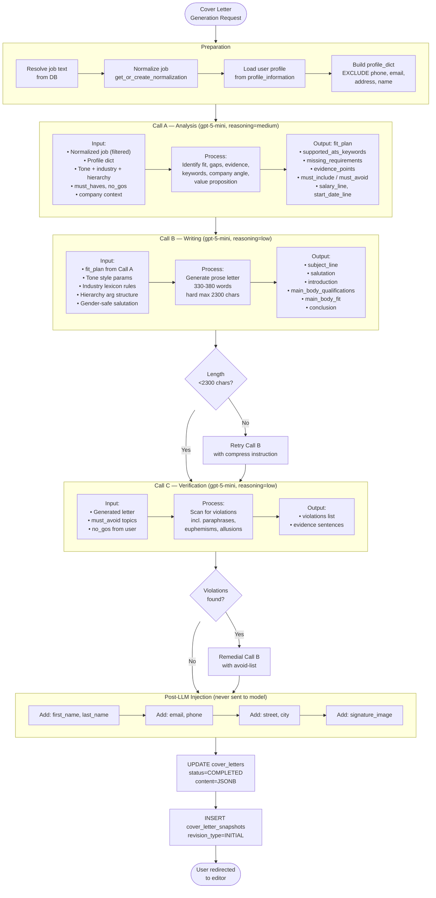
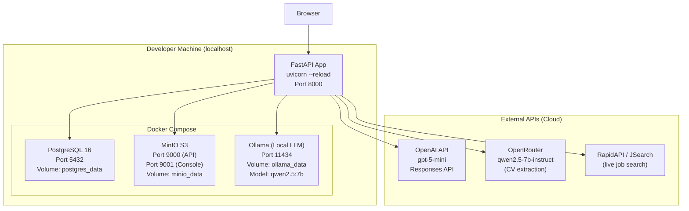
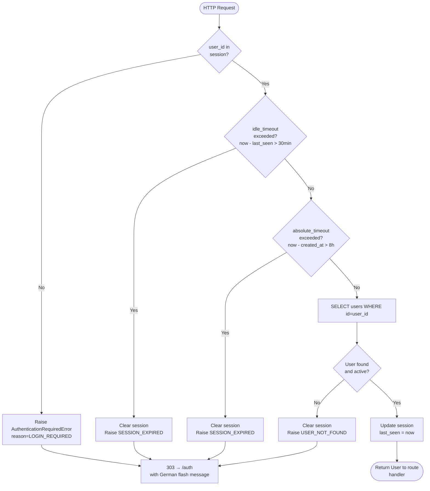

# Additional Diagrams

## Title
AI Job Copilot — AI Pipeline Flows & Deployment Diagram

---

## 1. Cover Letter Generation — 3-Call LLM Pipeline



---

## 2. Job Normalization Pipeline

```mermaid
flowchart LR
    A([Raw Job Text]) --> B{Already\nnormalized?}
    B -->|Yes| C[Load from\njob_normalizations]
    B -->|No| D[Build prompt\nfrom job_normalization.py v2]
    D --> E["OpenAI Responses API\nmodel: gpt-5-mini\nreasoning: medium\nstructured output: strict=False\nmax_tokens: 16,000"]
    E --> F[Validate → JobNormalizationSchema]
    F --> G[INSERT job_normalizations]
    G --> H[Append to\nevals/job_normalizations.jsonl]
    H --> C
    C --> I([Return\nJobNormalizationSchema])

    subgraph Schema["JobNormalizationSchema fields"]
        S1[title, company, location]
        S2[contact_person + gender]
        S3[industry_group, hierarchy_level]
        S4[role_summary]
        S5[responsibilities list]
        S6[required + nice_to_have competencies]
        S7[technical skills]
        S8[ats_keywords]
        S9[ad_language]
    end
```



---

## 3. CV Profile Extraction — 2-Step Pipeline

```mermaid
flowchart TD
    A([Raw CV Text\nfrom PDF]) --> S1

    subgraph STEP1["Step 1 — Text Reconstruction"]
        S1["OpenRouter: qwen2.5-7b-instruct\nprompt: profile_extraction_step1.py (step1_v1)\nTask: Rewrite as clean, structured\nplain text grouped by sections"]
        S1 --> S1O[Output: clean_text\n(plain text, all info preserved)]
    end

    S1O --> S2

    subgraph STEP2["Step 2 — Structured Extraction"]
        S2["OpenRouter: qwen2.5-7b-instruct\nprompt: profile_extraction.py (step2_v3)\nTask: Map clean_text → CandidateProfile\nusing beta.chat.completions.parse"]
        S2 --> S2O["Output: CandidateProfile\n• first_name, last_name\n• email, phone, street, city\n• target_role, seniority\n• work_experience (list)\n• education (list)\n• skills, languages\n• certifications, projects\n• publications, volunteering"]
    end

    S2O --> UPSERT[UPSERT profile_information\n(one row per user)]
    UPSERT --> LOG[Append to\nevals/profile_extractions.jsonl]
    LOG --> DONE([Profile available\nfor cover letter generation])
```

---

## 4. Deployment Architecture



---

## 5. Session Authentication Flow


