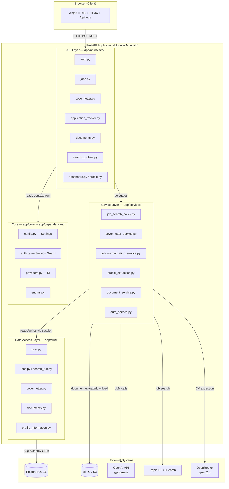

# Architecture Diagram

## Title
AI Job Copilot — High-Level Layered Architecture

## Explanation
The application follows a modular monolith pattern with four clearly separated layers. External systems (job API, OpenAI, MinIO) are accessed only through the service layer, keeping routes thin and CRUD modules stateless.

## Mermaid Diagram

