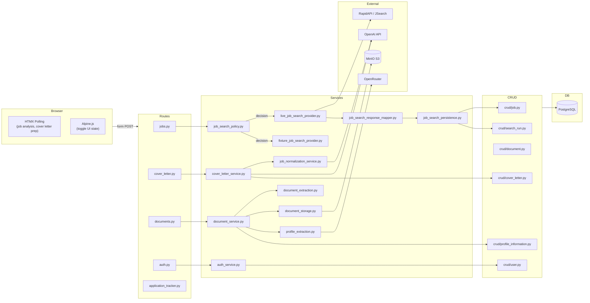

# Component Diagram

## Title
AI Job Copilot — Component Interaction Map

## Explanation
Shows which components call which, and which external services each component depends on. The service layer is the integration hub — it is the only layer that touches external APIs.

## Mermaid Diagram

