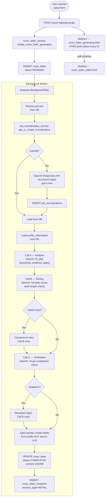
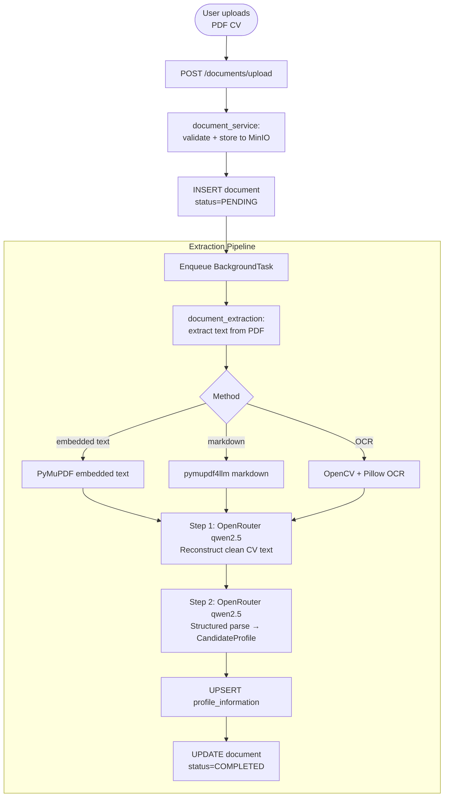

# Data Flow Diagram

## Title
AI Job Copilot — Request & Data Flow

## Explanation
Illustrates how data moves from browser to database and back, including AI calls, for the two most important workflows: job search and cover letter generation.

---

## Flow 1: Job Search Request

```mermaid
flowchart LR
    A([User clicks\n"Suchen"]) --> B[POST /jobs/search/profile_id]
    B --> C{job_search_policy:\ndecide_primary_search}
    C -->|BLOCKED| D[Render error flash\nand redirect]
    C -->|SHOW_EXISTING| E[Load cached run\nfrom DB]
    C -->|START_NEW_RUN| F{Provider\nselection}
    F -->|fixture| G[FixtureJobSearchProvider\nreturns hardcoded data]
    F -->|live| H[HTTP GET RapidAPI/JSearch\nhttpx client]
    G --> I[job_search_response_mapper:\nMap → ORM objects]
    H --> I
    I --> J[job_search_persistence:\nINSERT jobs, search_run, search_run_jobs]
    J --> K[(PostgreSQL)]
    E --> L[Render job_results.html]
    J --> L
```

---

## Flow 2: Cover Letter Generation



---

## Flow 3: CV Upload & Profile Extraction


