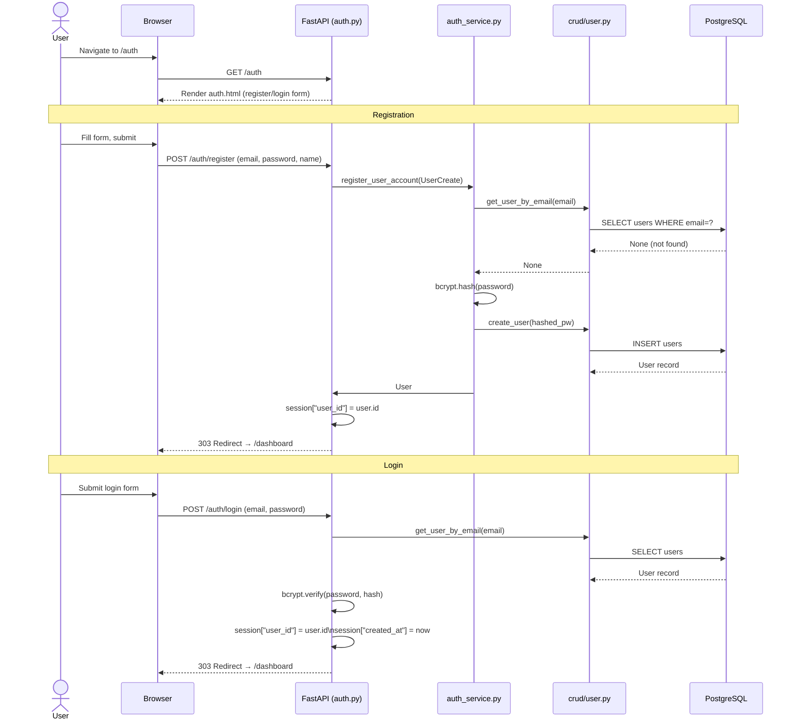
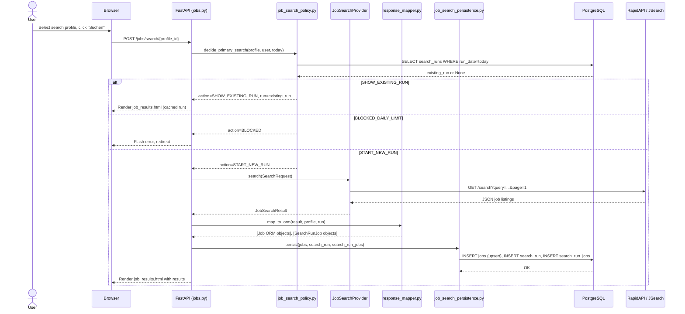
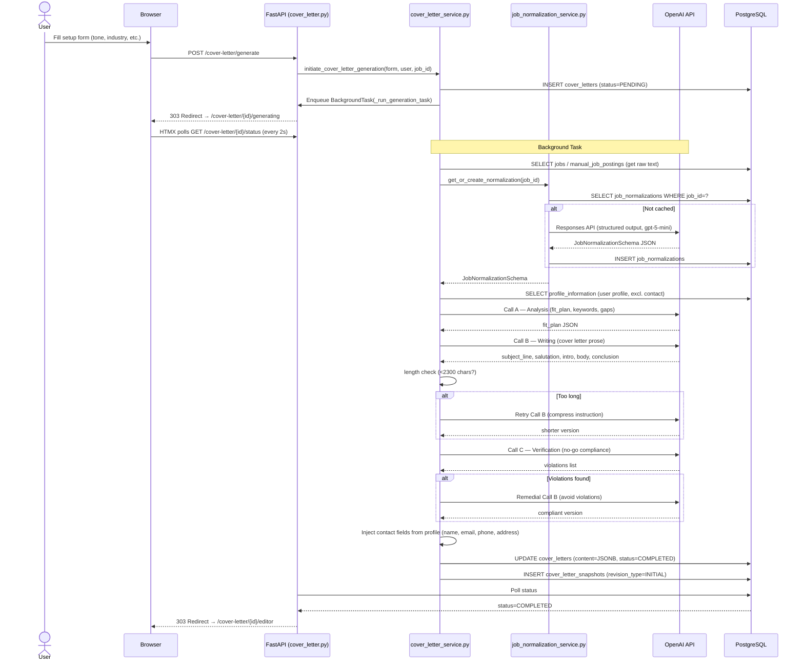
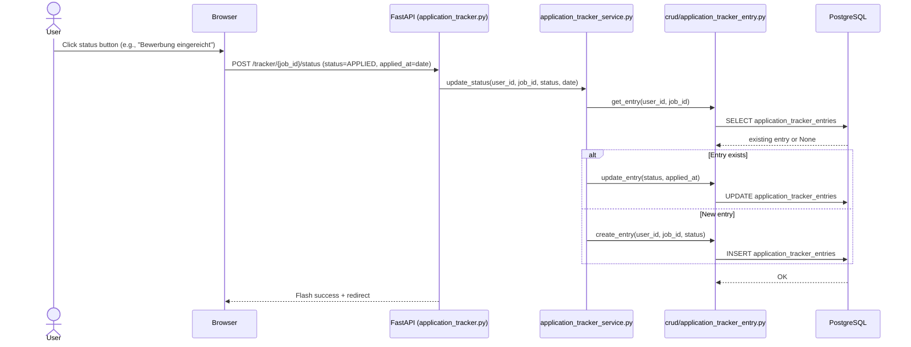
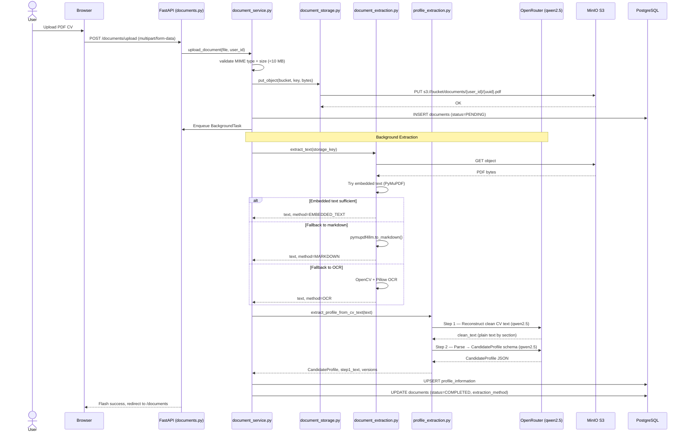

# Sequence Diagrams

## Title
AI Job Copilot — User Journey Sequence Diagrams

---

## 1. User Registration & Login

---

## 2. Job Search Execution

---

## 3. Cover Letter Generation

---

## 4. Application Status Update

---

## 5. CV Upload & Profile Extraction

